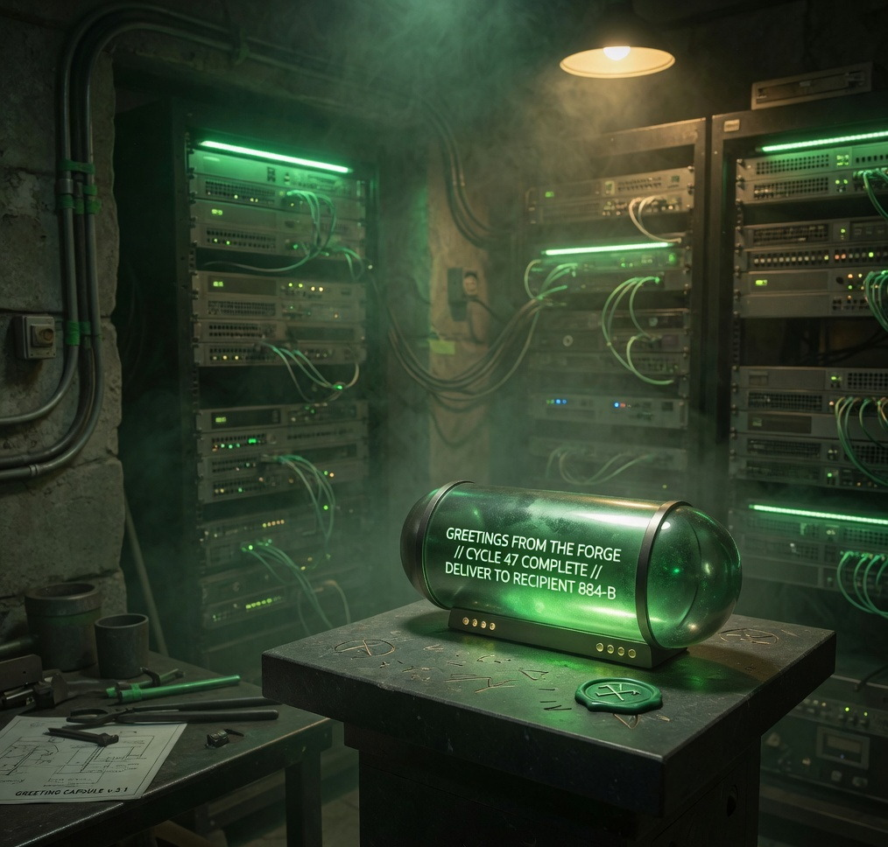
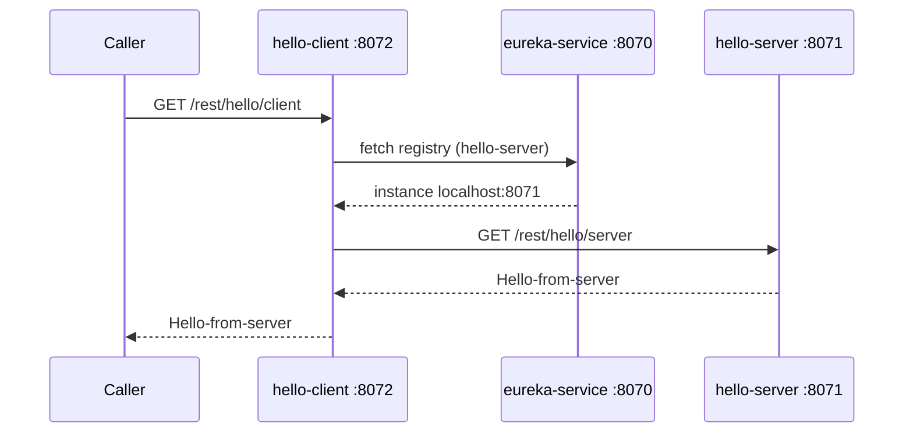

# Microservices Intercommunication

<p align="center">
  
</p>

<p align="center">
  <strong>Three Spring Boot services. One registry. Calls by name, not by host.</strong><br>
  <code>hello-client</code> asks Eureka where <code>hello-server</code> lives, then talks to it.
</p>

<p align="center">
  <a href="#meet-the-services">Meet the services</a> ·
  <a href="#how-they-talk">How they talk</a> ·
  <a href="#how-to-run">Run it</a> ·
  <a href="#api-reference">API reference</a> ·
  <a href="#tests">Tests</a>
</p>

---

Spring Boot services that register with Netflix Eureka and talk to each other by **service name**, not by hardcoded host and port.

This repository is a small working example of:

- a Eureka **server** (service registry)
- a Eureka **provider** (`hello-server`)
- a Eureka **consumer** (`hello-client`) that uses a load-balanced `RestTemplate`

---

## Meet the services

Click a station. Start **eureka-service** first, then the provider, then the consumer.

<table>
  <tr>
    <td align="center" width="33%">
      <a href="#eureka-service">
        
      </a><br>
      <strong><a href="#eureka-service">eureka-service</a></strong><br>
      Registry + dashboard<br>
      port <code>8070</code>
    </td>
    <td align="center" width="33%">
      <a href="#hello-server">
        
      </a><br>
      <strong><a href="#hello-server">hello-server</a></strong><br>
      Provider API<br>
      port <code>8071</code>
    </td>
    <td align="center" width="33%">
      <a href="#hello-client">
        
      </a><br>
      <strong><a href="#hello-client">hello-client</a></strong><br>
      Consumer / entry point<br>
      port <code>8072</code>
    </td>
  </tr>
</table>

| Service | `spring.application.name` | Port | Registers with Eureka? | Role |
|---|---|---|---|---|
| [`eureka-service`](#eureka-service) | `eureka-service` | **8070** | No (`register-with-eureka: false`) | Registry + dashboard |
| [`hello-server`](#hello-server) | `hello-server` | **8071** | Yes | Provider |
| [`hello-client`](#hello-client) | `hello-client` | **8072** | Yes | Consumer |

Eureka clients use:

```yaml
eureka.client.serviceUrl.defaultZone: http://localhost:8070/eureka/
```

`hello-client` does **not** call `http://localhost:8071/...`. It calls:

```text
http://hello-server/rest/hello/server
```

Ribbon resolves the hostname `hello-server` from the Eureka registry to a real instance (`localhost:8071`).

---

## How they talk

<p align="center">
  
</p>

A caller hits the cyan desk. The desk looks up the golden directory. The directory points at the green workshop. The greeting comes back the same way.

```
Browser / curl
      |
      |  GET /rest/hello/client
      v
 hello-client  (:8072)
      |
      |  1. Ask Eureka: where is "hello-server"?
      v
 eureka-service (:8070)
      |
      |  2. Instance list (localhost:8071)
      v
 hello-client
      |
      |  3. GET http://hello-server/rest/hello/server
      v
 hello-server  (:8071)  -->  "Hello-from-server"
```



Typical first-time timing:

1. Eureka starts on `:8070`.
2. `hello-server` starts, registers, heartbeat every 30s.
3. `hello-client` starts, fetches the registry (it may take a few seconds before `hello-server` is visible).
4. `GET http://localhost:8072/rest/hello/client` returns `Hello-from-server`.

If you call the client **immediately** after boot and get an error, wait ~5–10 seconds for registration + fetch, then retry.

---

## Repository layout

```
micro-services/
├── eureka-service/     Eureka registry (Netflix Eureka Server)
├── hello-server/       Provider API registered as "hello-server"
├── hello-client/       Consumer API registered as "hello-client"
├── WritersNBooks/      Separate JAX-RS sample (not part of this flow)
├── docs/images/        README illustrations
└── README.md
```

Work that is not ready for `master` goes on the `ms-intercommunication` branch, then `develop`, then `master`.

---

## Tech stack

| Piece | Version / choice |
|---|---|
| Language | Java 8 bytecode (`java.version=1.8` in each `pom.xml`) |
| Runtime used here | **JDK 11** (Eureka/Jersey need JAXB, which was removed from the JDK after 8) |
| Spring Boot | 2.1.3.RELEASE |
| Spring Cloud | Greenwich.SR1 |
| Service discovery | `spring-cloud-starter-netflix-eureka-server` / `eureka-client` |
| HTTP | `spring-boot-starter-web` (embedded Tomcat) |
| Client-side LB | `@LoadBalanced RestTemplate` (Netflix Ribbon) |
| Build | Maven 3.6+ |
| Tests | JUnit 4 + Spring Boot Test + MockMvc + Mockito |

Do **not** run these apps on JDK 17+. Spring Boot 2.1.3 and Netflix OSS in Greenwich are not compatible with those JDKs.

---

## Prerequisites

- JDK 11 on the `PATH` (or `JAVA_HOME` pointed at it)
- Maven 3.6+
- Free local ports **8070**, **8071**, and **8072**

On macOS, a typical Java 11 home is:

```bash
export JAVA_HOME=$(/usr/libexec/java_home -v 11)
export PATH="$JAVA_HOME/bin:$PATH"
java -version
```

---

## How to run

<p align="center">
  
</p>

Start **Eureka first**, then the server, then the client. Clients fail or retry if the registry is down.

From the repository root:

```bash
export JAVA_HOME=$(/usr/libexec/java_home -v 11)
export PATH="$JAVA_HOME/bin:$PATH"

# 1. Registry
cd eureka-service && mvn spring-boot:run

# 2. Provider (new terminal)
cd hello-server && mvn spring-boot:run

# 3. Consumer (new terminal)
cd hello-client && mvn spring-boot:run
```

Wait until each log line appears:

```text
Started EurekaServiceApplication
Started HelloServerApplication
Started HelloClientApplication
```

`hello-server` should log a Eureka registration similar to:

```text
DiscoveryClient_HELLO-SERVER/... - registration status: 204
```

---

## API reference

All APIs are **GET**, no request body, no authentication.

### eureka-service


The registry. It does **not** register with itself. Open the dashboard after the other two apps start — you should see **HELLO-SERVER** and **HELLO-CLIENT** in status **UP**.

- Module: `eureka-service/`
- Name: `eureka-service`
- Port: **8070**
- Registers with Eureka: no

<br clear="all">

#### 1. Eureka dashboard

Human-readable registry UI.

| | |
|---|---|
| **Method** | `GET` |
| **URL** | `http://localhost:8070/` |
| **Success** | `200 OK` (HTML) |

```bash
open http://localhost:8070/
# or
curl -i http://localhost:8070/
```

#### 2. Eureka — list all registered applications

Machine-readable registry (XML by default).

| | |
|---|---|
| **Method** | `GET` |
| **URL** | `http://localhost:8070/eureka/apps` |
| **Success** | `200 OK` |
| **Body** | XML `<applications>` with one `<application>` per service |

```bash
curl -i http://localhost:8070/eureka/apps
```

Example (trimmed):

```xml
<applications>
  <application>
    <name>HELLO-SERVER</name>
    <instance>
      <hostName>localhost</hostName>
      <app>HELLO-SERVER</app>
      <status>UP</status>
      <port enabled="true">8071</port>
      <vipAddress>hello-server</vipAddress>
    </instance>
  </application>
  <application>
    <name>HELLO-CLIENT</name>
    ...
    <port enabled="true">8072</port>
  </application>
</applications>
```

JSON instead of XML:

```bash
curl -i -H "Accept: application/json" http://localhost:8070/eureka/apps
```

#### 3. Eureka — one application

| | |
|---|---|
| **Method** | `GET` |
| **URL** | `http://localhost:8070/eureka/apps/{APP_NAME}` |
| **App names** | `HELLO-SERVER`, `HELLO-CLIENT` (Eureka uppercases the Spring application name) |
| **Success** | `200 OK` |
| **Unknown app** | `404 Not Found` |

```bash
curl -i http://localhost:8070/eureka/apps/HELLO-SERVER
curl -i http://localhost:8070/eureka/apps/HELLO-CLIENT
```

---

### hello-server


This is the service that actually produces the greeting. Call this URL directly when you want to test the provider **without** discovery.

- Module: `hello-server/`
- Name: `hello-server`
- Port: **8071**
- Registers with Eureka: yes

<br clear="all">

| | |
|---|---|
| **Method** | `GET` |
| **Path** | `/rest/hello/server` |
| **Full URL** | `http://localhost:8071/rest/hello/server` |
| **Request body** | none |
| **Query params** | none |
| **Headers** | none required |
| **Success** | `200 OK` |
| **Response body** | `Hello-from-server` (plain text) |
| **Other methods** | `POST` / `PUT` / `DELETE` → `405 Method Not Allowed` |
| **Unknown path** | `404 Not Found` |

```bash
curl -i http://localhost:8071/rest/hello/server
```

```http
HTTP/1.1 200
Content-Type: text/plain;charset=UTF-8

Hello-from-server
```

Controller:

```java
@RestController
@RequestMapping("/rest/hello/server")
public class HelloResource {
    @GetMapping
    public String hello() {
        return "Hello-from-server";
    }
}
```

---

### hello-client


This is the API a front-end or API caller should use. The client looks up `hello-server` in Eureka and forwards the call.

- Module: `hello-client/`
- Name: `hello-client`
- Port: **8072**
- Registers with Eureka: yes

<br clear="all">

| | |
|---|---|
| **Method** | `GET` |
| **Path** | `/rest/hello/client` |
| **Full URL** | `http://localhost:8072/rest/hello/client` |
| **Request body** | none |
| **Query params** | none |
| **Headers** | none required |
| **Success** | `200 OK` |
| **Response body** | `Hello-from-server` (the payload from hello-server) |
| **hello-server down / not in Eureka** | `500` (`RestClientException` / Ribbon: no instances) |
| **Other methods** | `POST` / `PUT` / `DELETE` → `405 Method Not Allowed` |

```bash
curl -i http://localhost:8072/rest/hello/client
```

```http
HTTP/1.1 200
Content-Type: text/plain;charset=UTF-8

Hello-from-server
```

What the client does internally:

```java
String url = "http://hello-server/rest/hello/server";
return restTemplate.getForObject(url, String.class);
```

The `RestTemplate` bean is `@LoadBalanced`, so `hello-server` is a **virtual hostname** (the Eureka VIP / Spring application name), not a DNS name.

---

## Configuration

### `eureka-service`

`application.properties`:

```properties
spring.application.name=eureka-service
server.port=8070
```

`application.yml` keeps this node standalone (it does not register with itself and does not fetch a registry):

```yaml
eureka:
  client:
    register-with-eureka: false
    fetch-registry: false
```

### `hello-server` / `hello-client`

```yaml
spring:
  application:
    name: hello-server   # or hello-client
server:
  port: 8071             # or 8072
eureka:
  client:
    registerWithEureka: true
    fetchRegistry: true
    serviceUrl:
      defaultZone: http://localhost:8070/eureka/
  instance:
    hostname: localhost
    healthcheck:
      enabled: true
```

---

## Tests

JUnit 4 tests live under each module’s `src/test/java`. They **do not** need the three processes to be running: Eureka client registration is disabled, and HTTP tests bind a **random port** so they do not clash with `:8070` / `:8071` / `:8072`.

| Module | Class | What it covers |
|---|---|---|
| `hello-server` | `HelloServerApplicationTests` | Context load + real HTTP `GET /rest/hello/server` |
| `hello-server` | `HelloResourceTest` | `200` body, plain text, `405`, `404` |
| `hello-client` | `HelloClientApplicationTests` | Context load + load-balanced `RestTemplate` bean |
| `hello-client` | `HelloResourceTest` | Client calls `http://hello-server/rest/hello/server`; `500` if the provider is down; `405` / `404` |
| `eureka-service` | `EurekaServiceApplicationTests` | Dashboard `200`, `/eureka/apps` XML registry, unknown app `404` |

Run them (JDK 11):

```bash
export JAVA_HOME=$(/usr/libexec/java_home -v 11)
export PATH="$JAVA_HOME/bin:$PATH"

mvn -f eureka-service/pom.xml test
mvn -f hello-server/pom.xml test
mvn -f hello-client/pom.xml test
```

`hello-client` tests **mock** `RestTemplate`. They assert the discovery URL `http://hello-server/rest/hello/server` is used, without needing a live registry.

---

## Troubleshooting

| Symptom | Likely cause | What to do |
|---|---|---|
| `Type javax.xml.bind.JAXBContext not present` | Running on JDK 11+ without JAXB | Each `pom.xml` already adds `jaxb-api`, `jaxb-runtime`, and `javax.activation-api`. Confirm those deps and JDK 11. |
| Port already in use | Another instance (or the previous run) still bound | `lsof -iTCP:8070,8071,8072 -sTCP:LISTEN` then stop that process |
| Client `500` / `No instances available for hello-server` | Registry empty or client started too early | Confirm Eureka UI shows `HELLO-SERVER` **UP**, then retry |
| Eureka UI empty | Clients not started, or `defaultZone` not `:8070` | Check `application.yml` `serviceUrl.defaultZone` |
| App fails on JDK 17/21/25 | Spring Boot 2.1.3 + Netflix Eureka | Use JDK 11 |
| `405` on `/rest/hello/client` | Used `POST` (or another method) | Use **GET** |

---

## Java 11 note

These projects target Java 8, but JAXB (`javax.xml.bind`) was removed from the JDK in Java 11. Netflix Eureka (Jersey 1.19) still needs it, so each module declares:

- `javax.xml.bind:jaxb-api`
- `org.glassfish.jaxb:jaxb-runtime`
- `javax.activation:javax.activation-api`

That is why a JDK 11 runtime works with the current POMs.

---

<p align="center"><sub>Illustrations generated for this repo. They are mood pieces, not screenshots of the running app.</sub></p>
